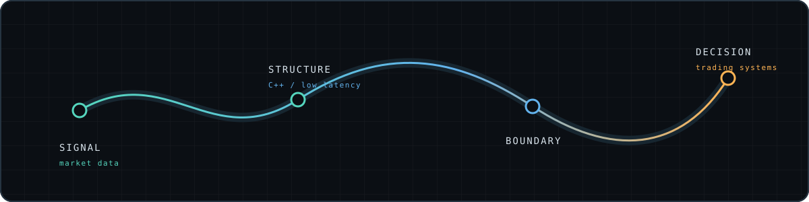

  

<h1 align="center">C++ systems for the moments between tick and trade</h1>

  Low-latency systems · market data · exchange connectivity · trading infrastructure

## About

I am interested in the hard edges of trading systems: where market data meets latency constraints, exchange connectivity meets wire details, and C++ has to stay close to the path.

## Areas of focus

| Area | Focus |
| --- | --- |
| C++ | Systems programming and performance-sensitive infrastructure |
| Low latency | Performance-sensitive system paths |
| Market data | Processing and moving market information through a system |
| Exchange connectivity | Connectors and protocol-facing infrastructure |
| Trading infrastructure | Systems surrounding market data and connectivity |

## Signal → system

The profile is intentionally focused on the technical surface rather than on private project names.

## Contact

[GitHub](https://github.com/be0hhh)
